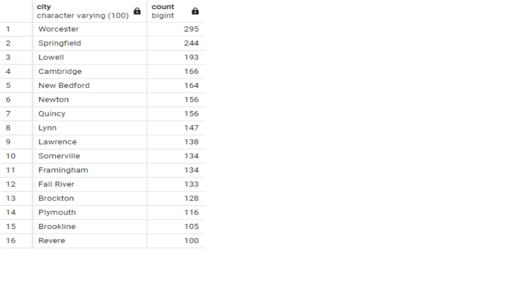

# Healthcare-SQL-Data

## Overview

The analysis was designed to explore patient data, focusing on demographics, encounter classifications, conditions, and immunizations across a healthcare database. Specific areas of interest included identifying unique encounter classes, analyzing inpatient ICU admissions, evaluating common conditions, and examining patient demographics in specific cities. The goal was to gain insights into healthcare trends, patient demographics, and common medical conditions within the dataset.

## Results

Overview of Encounter Types Across the Healthcare System

2023 Inpatient ICU Admissions Overview

Prevalent Health Conditions Identified in 2023 (Excluding Specific BMI Ranges)

Patient Distribution by City (Excluding Boston) with Significant Populations

## Conclusions
In summary,
The analysis underscores the complexity and diversity of healthcare needs within the dataset's patient population. The conditions analysis highlights prevalent health challenges. Immunization data, though not directly analyzed here, is crucial for understanding public health efforts and patient compliance with recommended vaccines. Overall, the data suggest ongoing challenges in managing chronic conditions, the importance of robust healthcare services to meet diverse needs, and the critical role of preventive care measures. Future analyses could further explore demographic factors affecting health conditions, trends in healthcare utilization, and outcomes of various treatments or interventions.

